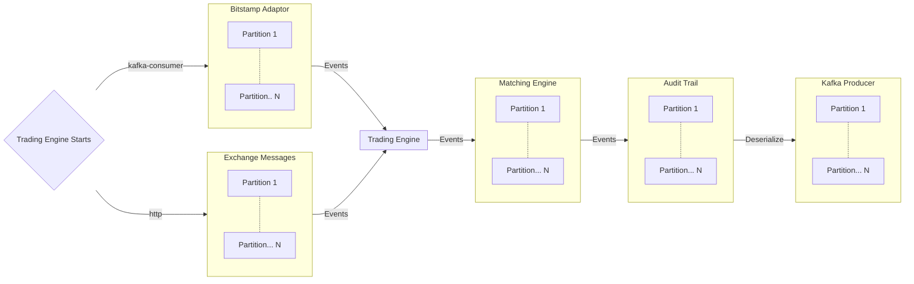

# Data Flow

This document describes the data flow of the application.

## Table of Content

* [Visual Flow Chart](#visual-flow-chart): Visual Flow Chart.

## Visual Flow Chart

```mermaid
flowchart LR;
    TES{Trading Engine Starts} ---> |kafka-consumer| BA
    TES{Trading Engine Starts} ---> |http| EXM
    
    subgraph BA[Bitstamp Adaptor]
        BSP1[Partition 1] -.- BSPN[Partition.. N]
    end
    
   subgraph EXM[Exchange Messages]
        EXP1[Partition 1] -.- EXP1N[Partition... N]
    end
    
    BA --> |Events| TAE
    EXM --> |Events|TAE
    subgraph TAE[Trading Engine]
    end
    
    TAE --> |Events| MAE
    subgraph MAE[Matching Engine]
       MAEP1[Partition 1] -.- MAEPN[Partition... N]
    end
    
    MAE --> |Events| AUT
    subgraph AUT[Audit Trail]
        AUTP1[Partition 1] -.- AUTPN[Partition... N]
    end
    
    AUT --> |Deserialize| KP
    subgraph KP[Kafka Producer]
            KPTP1[Partition 1] -.- KPTPN[Partition... N]
    end
```
